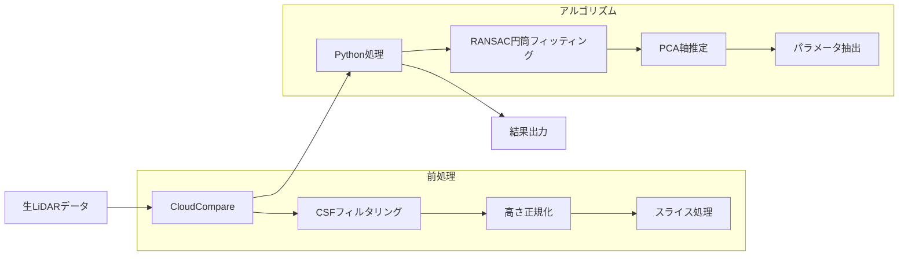
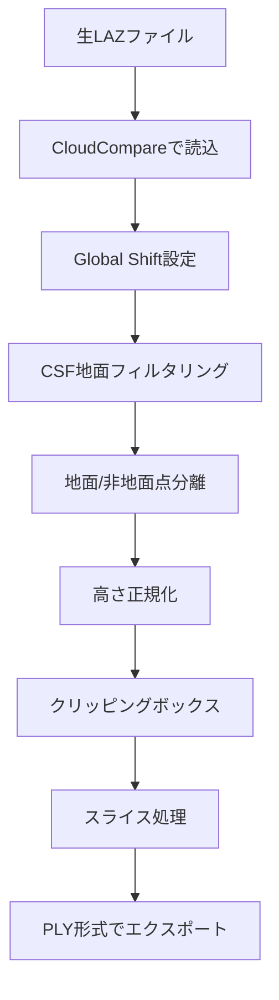

# 🌲 UAV搭載LiDARによる単木識別と樹木情報自動計測
## 研究進捗報告書

<div align="center">


**新潟森林調査プロジェクト**

</div>

---

## 📋 目次

1. [研究概要](#1-研究概要)
2. [技術アプローチ](#2-技術アプローチ)
3. [処理ワークフロー](#3-処理ワークフロー)
4. [検出結果と分析](#4-検出結果と分析)
5. [可視化成果](#5-可視化成果)
6. [精度検証](#6-精度検証)
7. [今後の課題と展望](#7-今後の課題と展望)

---

## 1. 研究概要

### 1.1 研究背景

無人航空機（UAV）搭載のレーザースキャナー（LiDAR）技術は、森林調査において革新的な方法を提供しています。従来の現地調査と比較して、広域の森林情報を効率的かつ高精度に取得することが可能です。

### 1.2 研究目的

本研究では、UAV搭載LiDAR点群データを用いて以下の目標を達成することを目指します：

| 目標 | 内容 | ステータス |
|------|------|------------|
| 🌳 **単木検出** | RANSAC円筒フィッティングによる個別樹木の識別 | ✅ 完了 |
| 📏 **DBH抽出** | 胸高直径（Diameter at Breast Height）の自動計測 | ✅ 完了 |
| 📍 **位置特定** | 各樹木のUTM座標出力 | ✅ 完了 |
| 📊 **可視化** | 2D分布図＋3Dオーバーレイ図＋インタラクティブプレビュー | ✅ 完了 |
| ✅ **精度検証** | 層別サンプリング＋RMSE統計 | ✅ 完了 |

### 1.3 研究対象地

| 調査地 | 説明 | データサイズ |
|--------|------|--------------|
| **San Juan Fault** | 主要研究地域 | 1.1 GB |
| **StREAM Lab** | 補助検証地域 | 473 MB |

---

## 2. 技術アプローチ

### 2.1 技術スタック



### 2.2 使用ソフトウェアとライブラリ

| カテゴリ | ツール | 用途 |
|----------|--------|------|
| **点群処理** | CloudCompare | 前処理、可視化 |
| **プログラミング** | Python 3.11 | アルゴリズム実装 |
| **点群ライブラリ** | Open3D | 点群読込・処理 |
| **数値計算** | NumPy, SciPy | 行列演算 |
| **機械学習** | scikit-learn | PCA分析 |
| **可視化** | Matplotlib | 図表生成 |
| **GUI** | Tkinter | ユーザーインターフェース |

### 2.3 RANSACアルゴリズム

```python
# 核心アルゴリズムの概要
def fit_cylinder_ransac(points, n_iterations=1000, threshold=0.05):
    """
    RANSAC + PCAによる円筒フィッティング
    - 3点をランダムサンプリング
    - PCAで円筒軸方向を推定
    - 点から軸への距離で半径を計算
    - 内点を統計して高さを算出
    """
```

**アルゴリズムパラメータ：**

| パラメータ | デフォルト値 | 説明 |
|------------|--------------|------|
| Distance Threshold | 0.06 m | 点から円筒軸への最大距離 |
| Min Points | 50 | 円筒体あたりの最小点数 |
| Min Radius | 0.03 m | 最小半径（3 cm） |
| Max Radius | 0.8 m | 最大半径（80 cm） |
| Min Height | 1.0 m | 最小高さ |
| Max Iterations | 100 | 最大検出樹木数 |

---

## 3. 処理ワークフロー

### 3.1 データ前処理フロー



### 3.2 CloudCompare処理手順（スクリーンショット付き）

#### ステップ1：データ読込設定
ファイル読込時に座標系とスケールの設定を行います。


---

#### ステップ2：CSF地面フィルタリング
布地シミュレーションフィルタ（Cloth Simulation Filter）を使用して地面点と非地面点を分離します。

算法处理.png)

**CSFフィルタリング結果の比較：**


---

#### ステップ3：高さ正規化
地面からの相対高さを計算し、DBH計測の基準高さを設定します。


---

#### ステップ4：領域抽出とセグメンテーション

**クリッピングボックスツール：**
工具.png)

**セグメント処理：**


**スライス処理：**
.png)

---

#### ステップ5：RANSAC検出

**RANSAC設定：**


**RANSAC検出結果：**


---

## 4. 検出結果と分析

### 4.1 検出概要

> [!IMPORTANT]
> **主要成果：61本の樹木を正常に検出し、DBHと高さのデータを抽出**

| 指標 | 値 |
|------|------|
| **検出樹木数** | 61本 |
| **データ品質** | クリーニング後のデータ残存率 100% |
| **高さ調整処理** | 59本に適用 |

### 4.2 DBH（胸高直径）統計

| 統計指標 | 値 |
|----------|------|
| **平均DBH** | 13.52 cm |
| **標準偏差** | 1.24 cm |
| **最小値** | 10.52 cm |
| **最大値** | 15.70 cm |

### 4.3 樹高統計

| 統計指標 | 値 |
|----------|------|
| **平均樹高** | 12.13 m |
| **標準偏差** | 1.41 m |
| **最小値** | 5.57 m |
| **最大値** | 14.75 m |

### 4.4 径階分布

```
径階分布 (DBH範囲別)
━━━━━━━━━━━━━━━━━━━━━━━━━━━━━━━━━━━━━━━━
[10, 15) cm  ████████████████████████████████████████ 54本 (88.5%)
[15, 20) cm  █████ 7本 (11.5%)
━━━━━━━━━━━━━━━━━━━━━━━━━━━━━━━━━━━━━━━━
```

| 径階クラス | 本数 | 割合 |
|------------|------|------|
| [10, 15) cm | 54本 | 88.52% |
| [15, 20) cm | 7本 | 11.48% |

### 4.5 バイオマス推定

> [!NOTE]
> バイオマス推定は一般的なアロメトリック方程式に基づいて計算されています。

| 指標 | 合計値 | 平均値（/本） |
|------|--------|---------------|
| **地上部バイオマス (AGB)** | 3.28 ton | 53.76 kg |
| **炭素貯蔵量** | 1.54 ton | 25.27 kg |

### 4.6 検出結果サンプル（上位10本）

| No. | 半径 (m) | DBH (cm) | 高さ (m) | 点数 | 細長比 | AGB (kg) |
|-----|----------|----------|----------|------|--------|----------|
| 1 | 0.0785 | 15.70 | 14.13 | 167 | 194.4 | 80.37 |
| 2 | 0.0783 | 15.67 | 14.10 | 86 | 237.0 | 79.93 |
| 3 | 0.0765 | 15.31 | 13.78 | 87 | 208.9 | 74.87 |
| 4 | 0.0765 | 15.30 | 13.77 | 87 | 304.6 | 74.73 |
| 5 | 0.0762 | 15.25 | 13.73 | 113 | 394.3 | 74.04 |
| 6 | 0.0759 | 15.19 | 13.67 | 115 | 192.2 | 73.23 |
| 7 | 0.0752 | 15.04 | 13.54 | 109 | 222.3 | 71.21 |
| 8 | 0.0750 | 14.99 | 13.49 | 112 | 323.6 | 70.54 |
| 9 | 0.0746 | 14.93 | 13.44 | 100 | 263.6 | 69.75 |
| 10 | 0.0743 | 14.85 | 13.37 | 99 | 312.5 | 68.70 |

---

## 5. 可視化成果

### 5.1 点群可視化

**俯瞰図（地面点を赤色で表示）：**


**法線ベクトル計算：**
.png)

### 5.2 GUIアプリケーション

本プロジェクトでは、使いやすいGUIアプリケーションを開発しました：

**主な機能：**
- 🌲 **検出タブ**: 入力ファイル選択、パラメータ調整、バッチ処理
- 🎨 **可視化タブ**: 2D図表生成、3Dインタラクティブプレビュー
- ✅ **自動可視化オプション**: 検出完了後に自動で図表生成

**起動コマンド：**
```bash
./03_Scripts/run.sh
```

### 5.3 出力図表の種類

| 図表タイプ | 説明 | 形式 |
|------------|------|------|
| 2D樹木分布図 | 平面上の樹木位置表示 | PNG |
| 3D点群オーバーレイ | 検出円筒を点群上に重畳 | PNG |
| 径階分布ヒストグラム | DBHの分布状況 | PNG |
| インタラクティブ3D | Open3Dによる回転・ズーム可能な表示 | ウィンドウ |

---

## 6. 精度検証

### 6.1 検証方法

1. **層別サンプリング**: DBHサイズに基づく層別抽出（9本選定）
2. **手動計測**: CloudCompareで座標に基づき各樹木を特定し、直径を手動計測
3. **誤差統計**: RMSE、MAE、平均誤差を計算

### 6.2 検証ワークフロー

```bash
# ステップ1: 検証サンプル生成
python 03_Scripts/generate_validation_sample.py

# ステップ2: CloudCompareで手動計測結果を入力
# validation_sample.csv の Manual_DBH_cm列を埋める

# ステップ3: 誤差統計計算
python 03_Scripts/calculate_validation_stats.py
```

### 6.3 フィルタリングパラメータ

品質管理のため、以下のフィルタリング基準を適用：

| パラメータ | 最小値 | 最大値 |
|------------|--------|--------|
| 直径 | 5.0 cm | 100.0 cm |
| 点数 | 30点 | - |
| 高さ | 1.0 m | 80.0 m |

---

## 7. 今後の課題と展望

### 7.1 現在の技術的制限

| 問題 | 原因 | 対策案 |
|------|------|--------|
| ⚠️ 高さ値の異常 | 疎な点群によるRANSACフィッティング誤差 | CHM（樹冠高モデル）の使用 |
| ⚠️ 手動前処理が必要 | CloudCompareでのスライス・フィルタリング | 自動化パイプラインの構築 |
| ⚠️ メモリ使用量が大きい | 大規模点群の読込 | ブロック分割処理の実装 |

### 7.2 短期改善計画

- [ ] 並列処理による検出速度向上
- [ ] 複数ファイルの自動バッチ処理
- [ ] 検出結果の3D可視化強化
- [ ] エラーハンドリングの改善

### 7.3 中期開発目標

- [ ] 機械学習による樹種分類
- [ ] 地上真値との精度評価システム
- [ ] GIS形式（Shapefile、GeoJSON）へのエクスポート
- [ ] 自動前処理パイプラインの構築

### 7.4 長期展望

- [ ] Webインターフェース開発
- [ ] クラウド処理への対応
- [ ] リアルタイムUAVデータストリーム処理
- [ ] 時系列モニタリングシステム

---

## 📁 付録：プロジェクト構造

```
Niigata_Research_Prep/
├── 00_Raw_Data/                    # 生LiDARデータ (.laz)
│   ├── SJFE_final_ULS.laz         # San Juan Fault (1.1GB)
│   └── SL_Winter2021_*.laz        # StREAM Lab (473MB)
│
├── 01_Processed/                   # 前処理済み点群
│   ├── San Juan Fault/            # 主要研究地域
│   │   ├── Off-Ground_Good-5m.ply # 非地面点（処理済）
│   │   └── *_cylinders.csv        # 検出結果 (250本)
│   └── StREAM Lab/                # 補助検証地域
│
├── 02_Screenshots/                 # 操作スクリーンショット
│   ├── San Juan Fault/            # 11枚
│   └── StREAM Lab/                # 10枚
│
├── 03_Scripts/                     # 🐍 コアスクリプト
│   ├── run.sh                     # 統一エントリーポイント
│   ├── gui_app.py                 # GUIメインプログラム
│   ├── tree_utils.py              # RANSACアルゴリズムコア
│   ├── detect_cylinders_v2.py     # CLI検出
│   ├── visualize_forest.py        # 可視化生成
│   ├── generate_validation_sample.py  # 検証サンプリング
│   ├── calculate_validation_stats.py  # RMSE計算
│   └── MANUAL.md                  # 中国語使用マニュアル
│
├── 04_Results/                     # 出力結果
│   ├── figures/                   # 図表 (.png)
│   ├── tables/                    # データ表 (.csv)
│   └── reports/                   # レポート
│
└── README.md                       # プロジェクト文書
```

---

## 📚 参考資料

1. CloudCompare Documentation - https://www.cloudcompare.org/doc/
2. Open3D Official Guide - http://www.open3d.org/docs/
3. RANSAC Algorithm Overview - Fischler & Bolles (1981)
4. Forest Inventory using UAV-LiDAR - 関連学術論文

---

<div align="center">

**報告書作成日**: 2026年01月29日  
**プロジェクト担当者**: zyc  
**文書バージョン**: 1.0

---

*本プロジェクトは学術研究目的のみに使用されます。*

</div>
